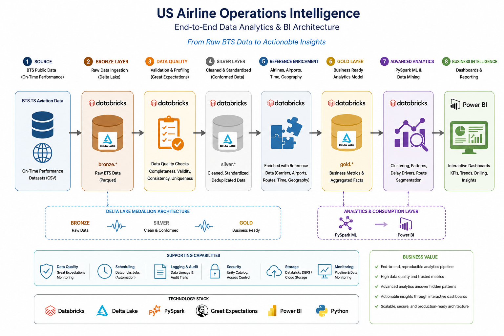
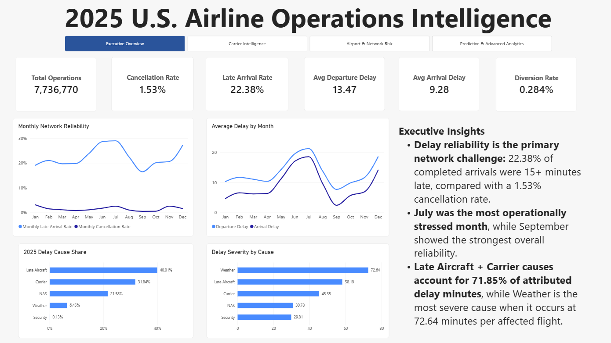
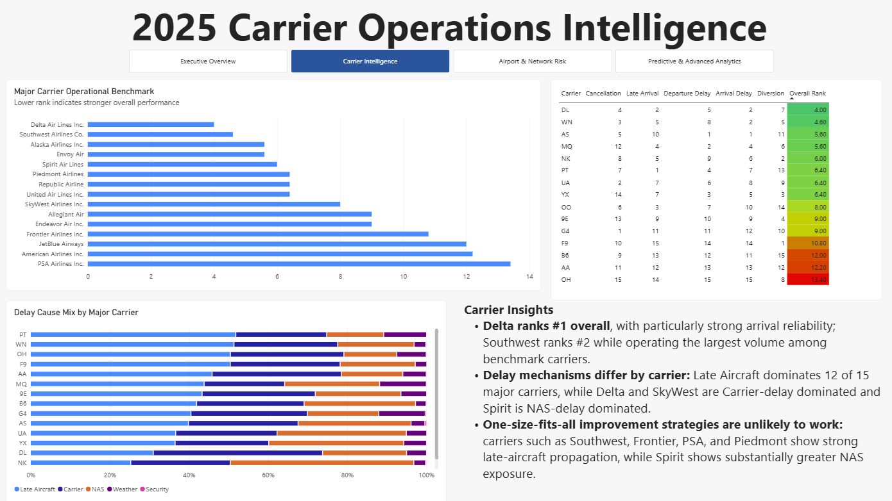
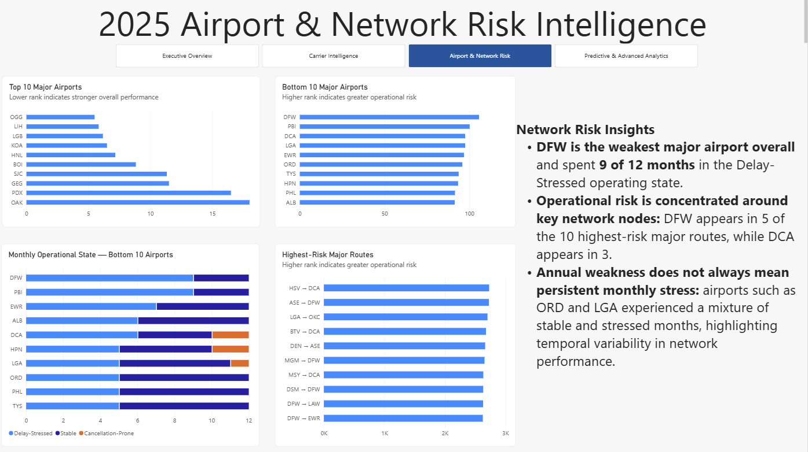
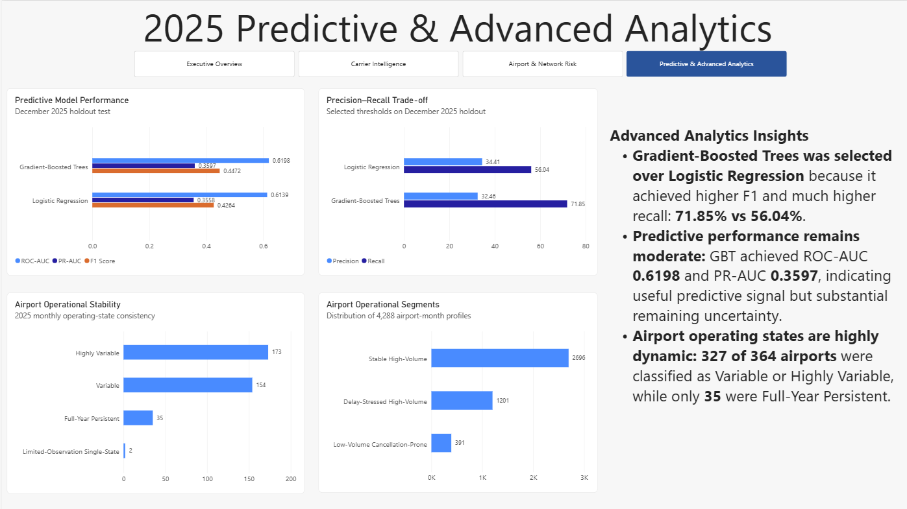

# U.S. Airline Operations Intelligence — 2025

End-to-end airline operations analytics project built with **Databricks, PySpark, Delta Lake, Machine Learning, K-Means clustering, and Power BI** using U.S. airline on-time performance data.

The project transforms approximately **7.7 million 2025 flight operations** into an analytics platform covering network reliability, carrier performance, airport risk, route performance, delay causes, predictive modeling, and operational segmentation.

---

## Executive Summary

This project demonstrates how large-scale airline operational data can be transformed into decision-ready intelligence through a complete analytics pipeline:

**Raw BTS Data → Databricks Bronze → Silver → Gold → PySpark Analytics → Machine Learning → Power BI**

The final solution analyzes:

- **7,736,770** canonical flight operations
- **21** operating carriers
- **364** airports
- **7,133** directional routes
- **12 months** of 2025 operations

The analytical layer includes carrier, airport, and route benchmarking; delay-cause decomposition; monthly operational trends; supervised delay prediction; and unsupervised airport segmentation.

The final Power BI solution contains four executive dashboard pages:

1. **Executive Overview**
2. **Carrier Intelligence**
3. **Airport & Network Risk**
4. **Predictive & Advanced Analytics**

---

## Business Problem

Airline operational performance cannot be understood through a single metric such as average delay or cancellation rate.

Executives and operations teams need to answer several connected questions:

- How reliable is the overall airline network?
- Which months experience the greatest operational stress?
- Which carriers perform consistently well across multiple KPIs?
- Which airports represent persistent or recurring operational risk?
- Which directional routes concentrate the greatest disruption?
- What causes most delay minutes?
- Can flight delays be predicted before departure?
- Do airports exhibit distinct operating patterns over time?

This project addresses those questions through a scalable analytical architecture designed to move from raw operational data to actionable business intelligence.

---

## Key Findings

### Network Performance

- **7,736,770** canonical flight operations were analyzed.
- **1.53%** of operations were cancelled.
- **22.38%** of completed arrivals were at least 15 minutes late.
- Average departure delay was **13.47 minutes**.
- Average arrival delay was **9.28 minutes**.
- **July** was the most broadly stressed month, while **September** showed the strongest overall reliability.

### Delay Causes

A total of **124,692,120 attributed delay minutes** were analyzed.

| Delay Cause | Share of Delay Minutes |
|---|---:|
| Late Aircraft | 40.01% |
| Carrier | 31.84% |
| NAS | 21.58% |
| Weather | 6.45% |
| Security | 0.13% |

**Late Aircraft + Carrier causes account for 71.85% of attributed delay minutes.**

Weather represents a relatively small share of total delay minutes but produces the highest severity when it occurs, averaging **72.64 minutes per affected flight**.

### Carrier Benchmarking

Among carriers with at least **100,000 annual operations**:

- **Delta Air Lines** ranked #1 overall.
- **Southwest Airlines** ranked #2 while operating the largest volume among benchmark carriers.
- Delay mechanisms differed substantially by carrier.
- Late Aircraft delay was the dominant cause for **12 of 15 major carriers**.
- Delta and SkyWest were primarily Carrier-delay dominated.
- Spirit Airlines was primarily NAS-delay dominated.

### Airport & Network Risk

Among airports with at least **10,000 annual departures**:

- **DFW** ranked as the weakest major airport overall.
- DFW spent **9 of 12 months** in the Delay-Stressed High-Volume operating state.
- Operational risk was concentrated around several network nodes.
- DFW appeared in **5 of the 10 highest-risk major routes**.
- DCA appeared in **3 of the 10 highest-risk major routes**.

### Predictive Analytics

Two supervised models were evaluated using a time-based train/validation/test design:

| Model | ROC-AUC | PR-AUC | Precision | Recall | F1 |
|---|---:|---:|---:|---:|---:|
| Gradient-Boosted Trees | 0.6198 | 0.3597 | 32.46% | 71.85% | 0.4472 |
| Logistic Regression | 0.6139 | 0.3558 | 34.41% | 56.04% | 0.4264 |

**Gradient-Boosted Trees was selected** because it achieved higher F1 and substantially higher recall.

### Airport Segmentation

K-Means clustering identified three recurring airport-month operating states:

| Operational Segment | Airport-Month Profiles |
|---|---:|
| Stable High-Volume | 2,696 |
| Delay-Stressed High-Volume | 1,201 |
| Low-Volume Cancellation-Prone | 391 |

Airport operating conditions were highly dynamic:

- **173 airports** were Highly Variable.
- **154 airports** were Variable.
- Only **35 airports** were Full-Year Persistent.

---

## Architecture & Technology Stack


### Data Architecture

The project follows a layered lakehouse design:

- **Bronze** — Raw BTS flight files ingested with full source fidelity.
- **Silver** — Cleaned, validated, typed, canonicalized, and reference-enriched flight data.
- **Gold** — Dashboard-ready KPI, benchmark, clustering, and predictive-model tables.

### Core Technologies

- **Databricks**
- **PySpark**
- **Spark SQL**
- **Delta Lake**
- **Python**
- **MLlib**
- **K-Means clustering**
- **Logistic Regression**
- **Gradient-Boosted Trees**
- **Power BI**
- **DAX**
- **Power Query**

### Analytical Design

The project combines:

- Large-scale data engineering
- Data-quality validation
- Dimensional/reference enrichment
- KPI engineering
- Carrier, airport, and route benchmarking
- Delay-cause decomposition
- Time-based predictive modeling
- Unsupervised operational segmentation
- Executive BI storytelling

---

## Data Pipeline

```text
BTS 2025 On-Time Performance Files
            ↓
        Bronze Layer
            ↓
 Data Quality & Canonicalization
            ↓
        Silver Layer
            ↓
    Reference Enrichment
            ↓
         Gold Layer
            ↓
 PySpark Analytics / ML / Clustering
            ↓
         Power BI
```

---

## Gold-Layer Analytics

The dashboard-ready Gold layer includes:

- Executive network summary
- Monthly network performance
- Annual carrier benchmark
- Annual airport benchmark
- Annual route benchmark
- Annual delay-cause decomposition
- Annual carrier delay profile
- Airport monthly operational segments
- Airport operational stability
- Predictive model comparison

---

## Dashboard Preview

### Executive Overview



### Carrier Intelligence



### Airport & Network Risk



### Predictive & Advanced Analytics



---

## Repository Structure

```text
US-Airline-Operations-Intelligence/
│
├── README.md
│
├── notebooks/
│   ├── 00_environment_setup
│   ├── 01_data_ingestion
│   ├── 02_data_quality
│   ├── 03_silver_transformation
│   ├── 04_reference_enrichment
│   ├── 05_gold_analytics
│   ├── 06_data_mining_pyspark
│   └── 07_business_intelligence
│
├── powerbi/
│   └── US-Airline-Operations-Intelligence.pbix
│
├── images/
│   ├── 01_executive_overview.png
│   ├── 02_carrier_intelligence.png
│   ├── 03_airport_network_risk.png
│   └── 04_predictive_advanced_analytics.png
│
└── docs/
    └── project_architecture.png
```

---

## Notes on Data

The raw BTS dataset is intentionally **not stored in this repository** because of its size.

The project documentation describes the source, ingestion process, transformations, and analytical logic needed to reproduce the workflow.

---

## Portfolio Value

This project demonstrates an end-to-end analytics workflow spanning:

**Data Engineering → Big Data Processing → Data Quality → Analytics Engineering → Machine Learning → Unsupervised Learning → Business Intelligence → Executive Decision Support**

It is designed to show not only technical implementation, but also the ability to translate large-scale operational data into clear, decision-oriented management insights.
